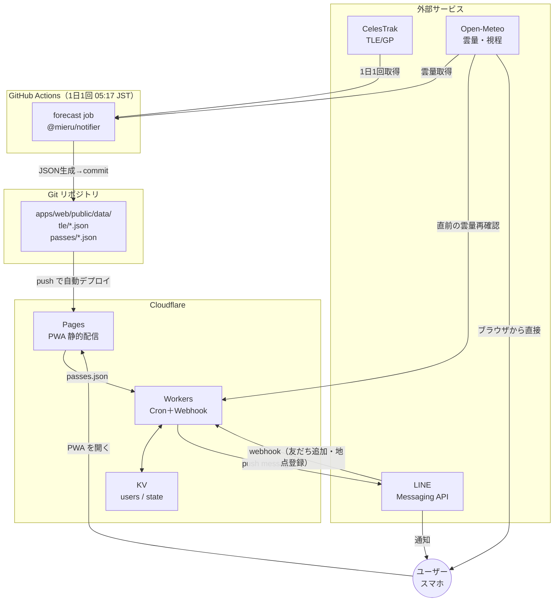

# 設計書 — ミエル（mieru）

| 項目 | 内容 |
|---|---|
| ドキュメント版 | v1.0 |
| 作成日 | 2026-09-18 |
| 対応要件 | `01-requirements.md` P0〜P3 |

---

## 1. 設計方針（3つの決定）

### 決定1：言語を TypeScript に統一する

軌道計算は **ブラウザ（アプリ表示用）とサーバ（LINE通知用）の両方**で必要になる。
Python(Skyfield) + TypeScript の二重実装は、**スコアリング基準がズレて「アプリでは見えると言っているのに通知が来ない」**という最悪のバグを生む。

> **`packages/core` に全ロジックを置き、PWA・通知バッチ・Worker が同一コードを import する。**

SGP4 実装は `satellite.js` v7 を使用。SGP4の位置誤差は約1km ＝ 肉眼観測では
時刻で数秒・方位で1°未満の影響しかなく、要件NFR-3（±30秒／±3°）を十分満たす。

### 決定2：Flutter Web ではなく React + Vite を使う

| 観点 | Flutter Web | React + Vite | 判断 |
|---|---|---|---|
| 初期バンドル | CanvasKit 込みで 1.5〜3 MB | 150〜200 KB (gzip) | **React**（NFR-1が満たせない） |
| 起動速度 | 数秒 | 1秒未満 | **React**（「2秒以内に結論」が要件） |
| PWA対応 | 可能だが手作業が多い | `vite-plugin-pwa` で完結 | **React** |
| SVG描画（スカイマップ） | CustomPaint 可 | ネイティブSVG | 同等 |
| LINE内ブラウザでの表示 | 不安定なことがある | 通常のWeb | **React** |

「ホーム画面から開いて2秒以内に結論」という体験が本アプリの核なので、**起動速度を最優先**する。

### 決定3：処理を「重い／時刻がシビア」の2軸で置き場所を分ける

Cloudflare Workers 無料プランは **Cron Trigger でも CPU 10ms** という制約がある
（有料は30秒）。7日分のSGP4探索は数百ms〜数秒かかるため、**無料Workerには載らない**。

```
                 CPU が重い          CPU が軽い
              ┌──────────────────┬──────────────────┐
 時刻が       │                  │  Cloudflare      │
 シビア       │   （該当なし）    │  Workers Cron    │
              │                  │  ・リマインド判定 │
              ├──────────────────┼──────────────────┤
 時刻が       │  GitHub Actions  │  Cloudflare      │
 緩い         │  ・7日分パス計算  │  Pages (静的配信) │
              │  ・TLE取得       │                  │
              └──────────────────┴──────────────────┘
```

Workerは「事前計算済みJSONを読む → 数値を比較 → LINE APIを叩く」だけなので CPU はほぼ 0。
**fetch の待ち時間は CPU 時間に計上されない**ため、10ms 制限に余裕で収まる。

> 将来 Workers Paid（$5/月）に上げれば GitHub Actions を廃止して Cloudflare 完結にできる。
> そのため通知バッチは `packages/core` を呼ぶだけの薄い層にし、実行環境を差し替え可能にしておく。

---

## 2. 全体アーキテクチャ



### 責務一覧

| コンポーネント | 責務 | 実行頻度 |
|---|---|---|
| `packages/core` | 軌道計算・可視判定・光度・天気取得・スコアリング。**副作用なし** | — |
| `apps/web` | PWA。地点設定、当夜判定の表示、スカイマップ描画 | ユーザー操作時 |
| `apps/notifier` | TLE取得 → 全登録地点の7日分パス計算 → JSON出力 | 1日1回（GH Actions） |
| `worker` | LINE Webhook受信、リマインド判定、LINE送信、送信済み管理、鮮度監視 | 15分毎＋1日1回 |
| Cloudflare KV | ユーザー設定、送信済みフラグ、月次送信数カウンタ | — |

### 縮退運転（NFR-4）

バックエンドが全滅しても PWA は動く。

| 障害 | PWAの挙動 |
|---|---|
| `passes/*.json` が古い／無い | **ブラウザ内でSGP4を実行**して自力で計算する（TLEはキャッシュ or CelesTrak） |
| Open-Meteo 応答なし | 天気「不明」と明示し、軌道条件のみのスコアを出す |
| 完全オフライン | Service Worker のキャッシュから前回結果を表示。「最終更新 ○時間前」を必ず出す |

---

## 3. ドメインモデル

```typescript
/** 観測地点 */
interface ObserverSite {
  id: string;            // "miyazaki-shi"
  name: string;          // "宮崎県宮崎市"
  latitudeDeg: number;
  longitudeDeg: number;
  altitudeM: number;     // 標高（m）。仰角に影響する
}

/** 追跡対象の衛星定義 */
interface SatelliteSpec {
  noradId: string;       // "25544"
  name: string;          // "ISS (ZARYA)"
  displayName: string;   // "国際宇宙ステーション"
  kind: 'iss' | 'css' | 'starlink-train' | 'starlink-operational';
  standardMagnitude: number; // 距離1000km・位相50%時の等級
  notifiable: boolean;   // 通知対象にするか
}

/** パス上の1点 */
interface TrackPoint {
  timeMs: number;
  azimuthDeg: number;    // 北=0, 東=90, 南=180, 西=270
  elevationDeg: number;  // 地平線=0, 天頂=90
  rangeKm: number;
  illumination: Illumination;
  magnitude: number | null; // 影の中なら null
}

/** 日照状態 */
interface Illumination {
  state: 'sunlit' | 'penumbra' | 'umbra';
  sunlitFraction: number; // 0..1（半影で連続変化）
}

/** 可視パス */
interface Pass {
  id: string;            // "25544-20260918T1042Z"
  noradId: string;
  satelliteName: string;
  start: TrackPoint;
  culmination: TrackPoint; // 最大仰角の点
  end: TrackPoint;
  durationSec: number;        // 地平線から地平線まで
  visibleDurationSec: number; // ★実際に光って見えている時間（影に入ると止まる）
  peakMagnitude: number;
  sunAltitudeAtCulminationDeg: number;
  track: TrackPoint[];   // 描画用（10〜20秒刻み）
}

/** 天気スナップショット */
interface WeatherSnapshot {
  fetchedAtMs: number;
  forTimeMs: number;
  cloudTotalPct: number;
  cloudLowPct: number;
  cloudMidPct: number;
  cloudHighPct: number;
  visibilityM: number | null;
  precipitationProbabilityPct: number | null;
}

/** 採点済みパス（アプリ・通知が扱う最終形） */
interface ScoredPass {
  pass: Pass;
  weather: WeatherSnapshot | null;
  score: PassScore;
}

interface PassScore {
  total: number;                // 0..100
  factors: Record<ScoreFactorKey, number>; // 各 0..1
  limitingFactor: ScoreFactorKey | null;   // 最も足を引っ張っている要素
  verdict: 'excellent' | 'good' | 'marginal' | 'poor';
  reasonJa: string;             // 「雲量92%のため見込み薄」
}

type ScoreFactorKey =
  | 'cloud' | 'elevation' | 'magnitude'
  | 'darkness' | 'hour' | 'duration';
```

---

## 4. アルゴリズム設計

### 4.1 パス探索（2段階法）

全探索は無駄が多いので、粗→精の2段階にする。

```
入力: SatRec（TLE由来）, ObserverSite, 探索開始時刻 t0, 探索日数 D

【ステップ1：粗探索】30秒ステップで t0 → t0+D を走査
  各ステップで SGP4 伝播 → 仰角 el を得る
  el が 負→正 に変わった区間を「パス候補の入り口」として記録
  el が 正→負 に変わった区間を「出口」として記録

【ステップ2：AOS/LOS の精密化】
  入口/出口の30秒区間に対し二分法を12回 → 誤差 30/2^12 ≒ 0.007秒
  （実用上は 8回＝約0.1秒で打ち切り）

【ステップ3：最大仰角の特定】
  AOS〜LOS 区間を黄金分割探索（三分探索）で40反復
  → 最大仰角点の時刻を 0.1 秒精度で得る

【ステップ4：フィルタ】以下のいずれかで破棄
  ・最大仰角 < 10°                       （地物に隠れる）
  ・最大仰角点で衛星が本影(umbra)内        （光らない）
  ・最大仰角点で観測地の太陽高度 > -6°     （空が明るい）

【ステップ5：トラック生成】
  AOS〜LOS を 最大60点 になるよう等間隔サンプリング
  各点で 方位角・仰角・距離・日照状態・等級 を計算
```

**計算量：** 7日 ÷ 30秒 = 20,160 回の伝播。`satellite.js` は1回あたり約10µs なので **約0.2秒**。
ブラウザでは Web Worker 上で実行し、UIをブロックしない（NFR-2）。

**なぜ30秒ステップで取りこぼさないか：**
ISS は地平線上に最短でも約2分（120秒）滞在する。30秒ステップなら
どんな低仰角パスでも最低3点は捕捉できる。より高速な衛星を追加する場合はステップを見直すこと。

### 4.2 太陽位置

**実装では `satellite.js` v7 の `sunPos()` を使う**（当初は自前実装を予定していたが、
v7 に Vallado の標準ルーチンが同梱されていることが判明したため）。

自前実装しない理由：SGP4 と同じ実装系・同じ座標系で揃えたほうが、
座標変換由来の系統誤差が両者で相殺されて有利になる。

```typescript
sunPos(jday(date))  →  { rsun: EciVec3<AU>, rtasc, decl }
```

観測地の太陽高度は、この ECI を GMST で ECF に変換し、
`ecfToLookAngles` に通して得る（**衛星と全く同じ経路を使い回す**）。

> **検証済み：** 至の日の南中高度は緯度と黄道傾斜角だけで決まる（`90 - |緯度 - 赤緯|`）。
> 宮崎市について夏至81.5°・冬至34.7°を**誤差0.5°以内**で再現することを自動テストで確認している。
> 外部データに依存しない強い検証になっている。

### 4.3 地球影の判定

「衛星が光っているか」は本アプリの根幹。単純な「夜側かどうか」では
**日没直後のパスをすべて取りこぼす**（ISSが見えるのはまさにこの時間帯）。

**実装では `satellite.js` v7 の `shadowFraction()` を使う。**

```typescript
shadowFraction(sunEciAU, satelliteEciKm)
  → 0（完全な日照）〜 1（本影）の連続値
```

これは「衛星から見た太陽円盤のうち、地球に隠されている面積の割合」を
**円‐円交差面積**で厳密に求めるモデルで、当初予定していた線形近似より正確。

本アプリ側では、これを3状態に分類して扱う。

| shadowFraction | 状態 | 意味 |
|---|---|---|
| ≦ 0.001 | `sunlit` | 完全に日照 |
| 0.001 〜 0.999 | `penumbra` | 半影。日照率 = 1 − shadowFraction |
| ≧ 0.999 | `umbra` | 本影。光らない＝見えない |

### 4.4 見かけの等級

衛星の光度は距離と位相角（どれだけ「満月」状態か）で決まる。
アマチュア天文で広く使われる標準式を採用する。

```
位相角 φ = angle( 衛星→太陽ベクトル , 衛星→観測者ベクトル )
照らされ率 k = (1 + cos φ) / 2                    // 0=新月状態, 1=満月状態

等級 mag = stdMag - 15.75 + 2.5 × log10( range_km² / k )
```

`stdMag` は **距離1000km・照らされ率50% のときの等級**として定義される
（上式に range=1000, k=0.5 を代入すると補正項が 0 になる）。

| 衛星 | stdMag | 根拠・備考 |
|---|---|---|
| ISS | **−1.8** | 広く使われる実測値。天頂通過時に −3.5〜−4.3 等になり実観測と一致 |
| Starlink（トレイン期） | **4.0** | 低高度＋パネル展開前の姿勢で明るい。実観測 1〜3等と整合。**要キャリブレーション** |
| Starlink（運用中） | **7.5** | 遮光対策後。実観測 6〜7等と整合。**通知対象外** |
| 天宮（CSS） | **−1.0** | P4で追加予定 |

> Starlink の値は公表された確定値ではない。実際に観測して補正すること。
> `packages/core/src/satellites.ts` に定数として切り出し、キャリブレーション可能にする。

### 4.5 スコアリング（乗算モデル）

**加算ではなく乗算**にするのが要点。加算だと「最大仰角85°だが雲量100%」が
高得点になってしまい、要件R-1（誤通知）を直撃する。乗算なら**どれか1つが致命的なら全体が0に近づく**。

```
score = 100 × w_cloud × w_elevation × w_magnitude × w_darkness × w_hour × w_duration
```

#### w_cloud（雲）— 透過率の積として扱う

下層雲は完全に遮るが、上層の巻雲は明るいISSなら透ける。この差を反映する。

```
遮蔽率 B = 1 - (1 - low/100) × (1 - mid/100) × (1 - 0.45 × high/100)
w_cloud = (1 - B) ^ 1.3
```

| 雲の状態 | B | w_cloud |
|---|---|---|
| 快晴 | 0.00 | 1.00 |
| 上層雲100%のみ | 0.45 | 0.46 |
| 中層雲50%のみ | 0.50 | 0.41 |
| 下層雲100% | 1.00 | **0.00** |

層別データが取れない場合は全雲量を中層として扱う。
**天気が取得できない場合は `null` を返し、通知処理側で送信を中止する（FR-3.3）。**

#### w_elevation（最大仰角）

```
w = 0.15 + 0.85 × clamp((maxEl - 10) / 40, 0, 1)
```
10°→0.15、25°→0.47、50°以上→1.00

#### w_magnitude（明るさ）

```
w = clamp((4.0 - peakMag) / 6.0, 0.02, 1.0)
```
−2等→1.00、+1等→0.50、+4等→0.02

#### w_darkness（空の暗さ）

太陽高度が −6°（市民薄明終わり）から −12°（航海薄明終わり）にかけて空は急速に暗くなる。

```
sunAlt > -6  →  0（フィルタ済みなので通常到達しない）
それ以外     →  w = 0.35 + 0.65 × clamp((-sunAlt - 6) / 6, 0, 1)
```

#### w_hour（生活時間帯）

「理論上見えるが午前3時」は通知する価値がない。

| JST | w |
|---|---|
| 18:00–22:30 | 1.00 |
| 22:30–24:00 | 0.75 |
| 04:30–06:00 | 0.55 |
| 00:00–04:30 | 0.25 |
| 上記以外 | 0.10 |

#### w_duration（継続時間）

```
w = clamp(visibleDurationSec / 240, 0.5, 1.0)
```
4分以上→1.00、2分→0.5（短いと見つける前に消える）

> **重要：** 渡すのは「通過時間」ではなく「**光って見えている時間**」。
> ISSは通過の途中で地球の影に入りフッと消えるため、
> 「10分52秒かけて空を横切る」パスでも実際に見えるのは「5分43秒」ということがある。
> 通過時間で採点すると、短命なパスを過大評価してしまう。
> UI・通知文でもこちらの数字を主として表示する。

#### 判定区分

| スコア | verdict | 意味 |
|---|---|---|
| 70〜100 | `excellent` | **通知対象。** はっきり見える |
| 45〜69 | `good` | 見える可能性が高い。アプリには出すが通知しない |
| 20〜44 | `marginal` | 条件次第。参考表示 |
| 0〜19 | `poor` | 期待しないほうがよい |

`limitingFactor` は最小の因子を返す。これが「今夜見えない理由」の表示（FR-5.2）になる。

---

## 5. データ契約

### 5.1 公開JSON（Cloudflare Pages 上の静的ファイル）

> **個人情報を含めない（NFR-7）。** 地点は「市区町村」の代表座標であり個人宅ではない。

```
/data/index.json              メタ情報・鮮度
/data/tle/tracked.json        追跡対象TLEのミラー
/data/passes/{locationId}.json  地点別の7日分パス
```

**`/data/index.json`**
```json
{
  "schemaVersion": 1,
  "generatedAtMs": 1789000020000,
  "tleFetchedAtMs": 1789000000000,
  "tleEpochs": { "25544": 1788950000000 },
  "locationIds": ["miyazaki-shi", "miyazaki-nobeoka"],
  "notifyThreshold": 70
}
```

**`/data/passes/{locationId}.json`**
```json
{
  "schemaVersion": 1,
  "locationId": "miyazaki-shi",
  "site": { "id": "miyazaki-shi", "name": "宮崎県宮崎市",
            "latitudeDeg": 31.9077, "longitudeDeg": 131.4202, "altitudeM": 15 },
  "generatedAtMs": 1789000020000,
  "validUntilMs": 1789604820000,
  "scoredPasses": [ /* ScoredPass[] */ ]
}
```

**サイズ見積：** 1パス約2.5KB（トラック60点込み）× 7日で平均12パス ≒ **30KB/地点**。
gzip後 約6KB。地点が20個でも 120KB。静的配信で十分に扱える。

### 5.2 Cloudflare KV

| Namespace | Key | Value | TTL |
|---|---|---|---|
| `USERS` | `u:{lineUserId}` | `{ locationId, enabled, threshold, registeredAtMs }` | なし |
| `USERS` | `index` | `string[]`（userIdの一覧） | なし |
| `STATE` | `sent:{passId}:{kind}` | `"1"`（kind = `advance` \| `reminder`） | 7日 |
| `STATE` | `quota:{YYYY-MM}` | 送信通数（整数） | 60日 |
| `STATE` | `alert:stale` | 最後に鮮度警告を送った時刻 | 2日 |

> LINE userId は KV にのみ保存し、リポジトリにも公開JSONにも書かない（NFR-6, NFR-7）。

---

## 6. 通知フロー

### 6.1 スケジュール

| Cron（UTC） | JST | 処理 |
|---|---|---|
| `7 1 * * *` | 10:07 | **予告判定**：今夜のパスを評価し、しきい値以上なら送信 |
| `*/15 * * * *` | 15分毎 | **リマインド判定**＋**鮮度監視** |
| GH Actions `17 20 * * *` | 05:17 | **予報再生成**（TLE取得 → 全地点計算 → commit） |

Cloudflare 無料プランの Cron Trigger はアカウント全体で5個まで。ここでは **2個**しか使わない。

### 6.2 予告通知（毎朝10:07）

```
for 各ユーザー:
  1. KV から locationId を取得（未設定なら既定地点）
  2. /data/passes/{locationId}.json を取得
  3. 今日の日没〜翌04:00 のパスを抽出
  4. score >= ユーザーしきい値（既定70） のものだけ残す
  5. 最高スコアのパス1件を選ぶ（複数通知は鬱陶しい）
  6. KV の sent:{passId}:advance をチェック → 既送信ならスキップ
  7. 月次送信枠（quota）を確認 → 残0なら中止して記録
  8. LINE push → sent フラグを立て quota をインクリメント
```

### 6.3 リマインド通知（15分毎）

```
1. 現在時刻の 25〜40分後 に開始するパスを全地点から抽出
2. そのパスについて Open-Meteo を再取得し、雲量を最新化
   ── ここが要件R-1の肝。朝は晴れ予報でも直前に曇ることがある
3. 再計算スコアが 50 未満に落ちていたら【送信しない】
   （既に予告を送っていた場合は「中止のお知らせ」を送る）
4. sent:{passId}:reminder をチェック → 冪等性を担保
5. LINE push
```

### 6.4 メッセージ文面

**予告（朝）**

```
🛰 今夜、ISSが見えます

9月18日(木) 19:42 → 19:48
────────────────
最大仰角  68°（かなり高い）
経路      南西 → ほぼ真上 → 北東
明るさ    −3.4等（金星より明るい）
雲量      12%（視界良好）
────────────────

19:42 に 南西 の空を見上げてください。
ゆっくり動く明るい星のように見えます。
点滅する光は飛行機なので別物です。

▶ 軌道を見る
https://mieru.pages.dev/pass/25544-20260918T1042Z
```

**リマインド（30分前）**

```
⏰ あと30分です

19:42、南西 の空。最大 68°。
雲量 8%、条件良好です。

▶ https://mieru.pages.dev/
```

**中止**

```
☁ 今夜の観測は中止です

雲が増えました（雲量 12% → 87%）。
次のチャンスは 9月20日(土) 19:05 です。
```

### 6.5 冪等性と枠管理

- 送信キーは `sent:{passId}:{kind}`。`passId` は **衛星ID＋最大仰角時刻(UTC分単位)** で生成するため、
  予報が再計算されても同一パスなら同じIDになる。
- 月次カウンタ `quota:{YYYY-MM}` は **送信人数分**加算する（broadcast=友だち数、push=1）。
- 残枠が `友だち数` を下回ったら送信せず、管理者にのみ1通だけ警告する。

### 6.6 ユーザー登録（P3・LINE Webhook）

| イベント | 挙動 |
|---|---|
| `follow`（友だち追加） | ウェルカム＋地区選択のクイックリプライを **reply** で返す（**reply は無料枠を消費しない**） |
| `message`（テキスト） | 「宮崎市」等の地名として解釈 → 最も近い登録地点に紐付け → reply で確認 |
| `postback`（地区選択） | KV の `u:{userId}` を更新 → reply で確認 |
| `unfollow` | KV から削除 |

**Webhook は `X-Line-Signature` を HMAC-SHA256 で必ず検証する（NFR-6）。**
検証失敗は 401 を返し、本文を一切処理しない。

---

## 7. UI 設計

### 7.1 デザイン言語

暗所で見るアプリなので、**明るい白背景は禁物**。暗順応（目が暗さに慣れた状態）を壊さない配色にする。

| トークン | 値 | 用途 |
|---|---|---|
| `--bg` | `#05070D` → `#0B1020` 縦グラデ | 夜空。ほぼ黒だが完全な黒にはしない |
| `--surface` | `rgba(255,255,255,0.04)` + `blur(20px)` | カード |
| `--border` | `rgba(255,255,255,0.09)` | 境界（影ではなく線で階層を作る） |
| `--accent` | `#FFC46B`（アンバー） | 「見える」。赤寄りで暗順応を壊しにくい |
| `--orbit` | `#7DD3FC`（シアン） | 軌道線。アンバーとの対比で経路が読める |
| `--muted` | `#5B6479` | 「見えない」状態 |
| `--text` | `#E8ECF5` / 副 `#8B95AC` | 本文 |
| 角丸 | 20px（カード）/ 999px（チップ） | |
| フォント | 本文 `Noto Sans JP`、数値 `Roboto Mono`（等幅で時刻が揃う） | |
| モーション | Framer Motion spring（stiffness 220 / damping 26） | 天体の慣性を感じる動き |

**影は使わない。** 発光（`box-shadow: 0 0 40px rgba(255,196,107,.15)`）と境界線で階層を表現する。
暗い画面でドロップシャドウは見えないため。

### 7.2 画面構成

| ルート | 画面 | 内容 |
|---|---|---|
| `/` | **今夜** | 結論ヒーロー → スカイマップ → 天気ストリップ → 次のパス |
| `/forecast` | **7日間** | 日別グルーピングのパス一覧（スコアバー付き） |
| `/pass/:id` | **パス詳細** | 大きなスカイマップ、時刻ごとの方位表、共有 |
| `/settings` | **設定** | 地点、通知しきい値、LINE連携、対象衛星 |

### 7.3 結論ヒーロー（FR-5.1）— 最重要コンポーネント

起動して最初に目に入る領域。**状態は3つだけ**。

```
┌─────────────────────────────────┐
│                                 │
│   今夜は見えます                  │  ← 32px, --accent, 太字
│                                 │
│   19:42  南西の空                 │  ← 48px 等幅数字
│   最大 68° · −3.4等 · 雲量12%     │  ← 14px, --text-sub
│                                 │
│   [ 詳しく見る ]                  │
└─────────────────────────────────┘
```

```
┌─────────────────────────────────┐
│   今夜は見られません               │  ← --muted
│                                 │
│   雲量 92%                       │  ← 理由を必ず出す（FR-5.2）
│   次のチャンスは 9/20(土) 19:05    │  ← 必ず「次」を示して離脱を防ぐ
└─────────────────────────────────┘
```

```
┌─────────────────────────────────┐
│   今夜はパスがありません            │
│   ISSの可視期間は約2か月ごとです     │  ← 知識で納得させる
│   次のチャンスは 10/14(火)頃        │
└─────────────────────────────────┘
```

### 7.4 スカイマップ（FR-5.3, 5.4）

**天頂を中心とした極座標（方位投影）**。プラネタリウムで寝転んで空を見上げた向きに対応する。

```
座標変換:  r = (90 - elevation) / 90 × R
           角度 = azimuth（北が上、時計回り）
           x = cx + r × sin(az)
           y = cy - r × cos(az)
```

- 外周円＝地平線（仰角0°）、中心＝天頂（90°）
- 仰角 30°・60° に補助リング（破線、`--border`）
- 方位ラベル **北・東・南・西** を外周に配置
- 軌道線：`--orbit` のグラデーションパス。**影に入る区間は破線＋不透明度50%**にして
  「ここで消える」ことを視覚化する（ISSは天頂付近でフッと消えることが多く、これを知らないと驚く）
- 最大仰角点に `--accent` のドット＋グロー、時刻ラベル
- 開始点に「ここから」、終了点に「ここで消える」のマイクロラベル
- 軌道線は `stroke-dasharray` アニメーションで **1.2秒かけて描画**（方向が直感的に伝わる）
- 端末の方位センサー（`deviceorientation`）が使える場合、現在向いている方角のハイライトを重ねる（P4）

### 7.5 PWA 要件（FR-5.7, 5.8）

| 項目 | 設定 |
|---|---|
| `display` | `standalone` |
| `theme_color` / `background_color` | `#05070D` |
| アイコン | 192 / 512 / maskable 512 |
| Service Worker | `vite-plugin-pwa`（Workbox）、`registerType: 'autoUpdate'` |
| `/data/*.json` | **NetworkFirst**（鮮度優先、失敗時キャッシュ、24時間保持） |
| Open-Meteo | **NetworkFirst**、1時間保持 |
| アプリシェル | **Precache** |
| 鮮度表示 | データ取得時刻を保持し「最終更新 ○時間前」を常時表示 |

---

## 8. ディレクトリ構成

```
mieru/
├─ package.json                  # npm workspaces ルート
├─ tsconfig.base.json
├─ docs/
│   ├─ 01-requirements.md
│   ├─ 02-design.md
│   └─ 03-tasks.md
│
├─ packages/core/                # ★ 全ロジックの単一の置き場所
│   ├─ src/
│   │   ├─ index.ts              # 公開API（バレル）
│   │   ├─ types.ts              # ドメインモデル
│   │   ├─ constants.ts          # 物理定数・しきい値
│   │   ├─ time.ts               # JST/UTC 変換・和文の日時書式
│   │   ├─ geometry.ts           # ベクトル演算
│   │   ├─ observer.ts           # 観測地点の座標変換（ECF/ECI）
│   │   ├─ sun.ts                # 太陽位置・観測地の太陽高度
│   │   ├─ shadow.ts             # 本影/半影判定
│   │   ├─ magnitude.ts          # 等級推定
│   │   ├─ satellites.ts         # 衛星カタログ・stdMag
│   │   ├─ tle.ts                # TLE取得・パース・元期検証
│   │   ├─ passes.ts             # ★ パス探索エンジン
│   │   ├─ weather.ts            # Open-Meteo クライアント
│   │   ├─ scoring.ts            # ★ スコアリング
│   │   ├─ select.ts             # 今夜のパス抽出・次の好機・日別集計
│   │   ├─ forecast.ts           # 軌道＋天気＋採点を束ねる入口
│   │   ├─ sites.ts              # 日本の地点マスタ
│   │   └─ format.ts             # 方位の和名・等級の言い換え等
│   └─ test/
│       ├─ fixtures/iss.ts       # 実TLEの固定フィクスチャ
│       ├─ sun.test.ts           # 至の日の南中高度（理論値と照合）
│       ├─ magnitude.test.ts     # 等級式の定義・単調性
│       ├─ passes.test.ts        # 物理的不変量（高度・傾斜角・周期）
│       └─ scoring.test.ts       # 乗算特性・天気不明時の挙動
│
├─ apps/web/                     # PWA（React 19 + Vite 8 + Tailwind 4）
│   ├─ public/
│   │   ├─ data/                 # ← notifier が生成、Pages が配信
│   │   └─ icons/
│   ├─ src/
│   │   ├─ main.tsx
│   │   ├─ App.tsx
│   │   ├─ styles.css            # Tailwind v4 の @theme でトークン定義
│   │   ├─ workers/forecast.worker.ts   # Web Worker（SGP4計算）
│   │   ├─ hooks/
│   │   ├─ components/
│   │   │   ├─ VerdictHero.tsx
│   │   │   ├─ SkyMap.tsx        # ★ SVG極座標描画
│   │   │   ├─ PassCard.tsx
│   │   │   ├─ ScoreBar.tsx
│   │   │   └─ WeatherStrip.tsx
│   │   └─ routes/
│   │       ├─ Tonight.tsx
│   │       ├─ Forecast.tsx
│   │       ├─ PassDetail.tsx
│   │       └─ Settings.tsx
│   └─ vite.config.ts
│
├─ apps/notifier/                # GitHub Actions で走るバッチ
│   └─ src/
│       ├─ buildForecast.ts      # TLE取得→全地点計算→JSON出力
│       └─ locations.ts          # 予報を生成する地点のリスト
│
├─ worker/                       # Cloudflare Worker
│   ├─ src/
│   │   ├─ index.ts              # fetch + scheduled ハンドラ
│   │   ├─ line.ts               # Messaging API クライアント・署名検証
│   │   ├─ messages.ts           # 文面生成
│   │   ├─ notify.ts             # 予告/リマインド判定ロジック
│   │   └─ store.ts              # KV アクセス
│   └─ wrangler.toml
│
└─ .github/workflows/
    └─ forecast.yml
```

---

## 9. 技術スタックとバージョン

| 領域 | 採用 | バージョン | 選定理由 |
|---|---|---|---|
| 言語 | TypeScript | 5.x | サーバ／ブラウザでロジック共有（NFR-9） |
| 軌道計算 | `satellite.js` | ^7.1 | 事実上の標準SGP4実装。精度は要件を満たす |
| UI | React | ^19.3 | エコシステム・PWA対応の成熟度 |
| ビルド | Vite | ^8.3 | 起動・ビルドが速い。PWAプラグインが優秀 |
| スタイル | Tailwind CSS | ^4.3 | v4のCSS-firstな `@theme` でデザイントークンを一元管理 |
| アニメ | `motion`（旧framer-motion） | ^13 | spring物理。天体の動きに合う |
| ルーティング | `react-router` | ^7 | 標準的 |
| PWA | `vite-plugin-pwa` | ^1.3 | Workbox設定を宣言的に書ける |
| テスト | Vitest | ^5 | Viteと同一の変換系。設定が不要 |
| Worker | Cloudflare Workers + Wrangler | 最新 | 無料枠・Cron・KV・低レイテンシ |
| LINE | `@line/bot-sdk` | ^11 | 型定義が付く。※Worker側は依存を減らすため fetch 直叩きでもよい |

---

## 10. セキュリティ・プライバシー

| 項目 | 方針 |
|---|---|
| LINE チャネルシークレット／アクセストークン | Cloudflare Workers の **Secrets** に保存。リポジトリに置かない |
| Webhook 署名検証 | `X-Line-Signature` を HMAC-SHA256 で検証。不一致は 401 |
| LINE userId | Cloudflare KV のみ。公開JSON・Gitには一切書かない |
| 位置情報 | 端末の `localStorage` のみ。サーバに送らない。予報は「市区町村」単位でのみ生成 |
| CSP | `default-src 'self'`; `connect-src 'self' https://api.open-meteo.com` |
| 依存パッケージ | Dependabot を有効化。`npm audit` を CI に組み込む |
| リポジトリ公開 | コードは公開可。秘密情報は Secrets のみ |

---

## 11. テスト戦略

| レイヤ | 対象 | 手法 |
|---|---|---|
| 単体 | `sun.ts` | 既知日時の太陽赤経・赤緯と照合（誤差0.02°以内） |
| 単体 | `shadow.ts` | ISSが確実に本影内／日照中の既知時刻で判定 |
| 単体 | `magnitude.ts` | 天頂通過時のISSが −3〜−4.5等の範囲に入ること |
| 単体 | `scoring.ts` | 境界値（雲量0/50/100、仰角10/45/85）と乗算特性（1因子0→総合0） |
| **結合** | `passes.ts` | **Heavens-Above の実予報と突合。開始時刻±30秒、最大仰角±2°、方位角±3°**（要件NFR-3の検証） |
| 結合 | `weather.ts` | Open-Meteo のレスポンスをモックし、欠損時に `null` を返すこと |
| 結合 | `notify.ts` | 冪等性（二重送信しない）、枠超過時に停止すること |
| E2E | PWA | 地点設定 → 予報表示 → オフライン再読込 で前回結果が出ること |
| 手動 | 実観測 | **実際に空を見て、予報時刻に見えるかを記録する。これが最終検証** |

---

## 12. 未確定事項

| # | 項目 | 判断が必要なタイミング |
|---|---|---|
| U-1 | Starlink の `stdMag` 実測補正 | P4着手時。実観測データが要る |
| U-2 | 予報を生成する地点リストの範囲（宮崎のみ／全国主要都市） | P1完了時。JSONサイズとのトレードオフ |
| U-3 | 独自ドメインを使うか（`*.pages.dev` のままか） | P2デプロイ時 |
| U-4 | 友だち数が増えて200通/月を超えた場合の対応 | 運用開始後 |
| U-5 | 天宮（CSS）を追加するか | P4 |
