# タスク書 — ミエル（mieru）

| 項目 | 内容 |
|---|---|
| ドキュメント版 | v1.0 |
| 作成日 | 2026-09-18 |
| 対応文書 | `01-requirements.md` / `02-design.md` |
| 総見積 | **約 58 時間**（実装のみ。調査・実観測検証を除く） |

---

## 進捗（2026-09-18 時点）

| M | 状態 | 備考 |
|---|---|---|
| **M0** 基盤 | ✅ 完了 | npm workspaces / Vitest / Tailwind v4 |
| **M1** コアエンジン | ✅ 完了 | **59テスト全通過。** 実予報との突合（下記）のみ未実施 |
| **M2** PWA | 🟡 ほぼ完了 | 4画面・スカイマップ・PWA化まで完了。実機確認が残 |
| **M3** バッチ/デプロイ | 🟡 実装完了 | ローカル実行は成功。Cloudflare Pages 接続が残 |
| **M4** LINE通知 | 🟡 実装完了 | コードは全て揃った。LINEチャネル作成とデプロイが残 |
| **M5** 個別化 | ✅ 実装済 | Webhook で地点登録まで実装（M4に前倒しで含めた） |

### 実測値（目標との比較）

| 指標 | 目標 | 実測 | |
|---|---|---|---|
| 初期JSバンドル | 200KB(gzip)以内 | **93.9KB** | ✅ |
| 予報JSON（1地点） | 10KB(gzip)以内 | **10KB**（最大の地点） | ✅ |
| 7日分のパス探索 | 1.5秒以内 | **0.2秒**（Node実測） | ✅ |
| 太陽高度の精度 | — | **理論値と0.5°以内**（自動テスト） | ✅ |
| 予報バッチ全体 | — | 29地点 17秒 | ✅ |

### 残っている作業（優先順）

1. **実観測による検証** — 予報時刻に実際に空を見る。これ以外に最終的な確かめようがない
2. Heavens-Above との突合（開始時刻±30秒／最大仰角±2°／方位角±3°）
3. Cloudflare Pages への接続とデプロイ
4. LINE公式アカウント作成 → Worker デプロイ → 実機で通知受信確認
5. iPhone / Android の実機でホーム画面追加を確認

---

## 進め方の原則

1. **`packages/core` を最初に、テスト付きで完成させる。**
   ここが間違っていると、UIも通知も全部間違う。UIから作り始めない。
2. **各マイルストーンの完了条件を満たしてから次へ進む。** 並行着手しない。
3. **M2 完了時点で「自分が使えるアプリ」になっている**こと。通知がなくても価値が出る状態を先に作る。
4. LINE連携（M4）は**最後**。外部サービス連携は不確実性が高く、先にやると全体が止まる。

---

## マイルストーン一覧

| M | 名称 | 対応Phase | 見積 | 完了条件 |
|---|---|---|---|---|
| **M0** | 基盤セットアップ | — | 3h | `npm run build` と `npm test` が全パッケージで通る |
| **M1** | コアエンジン | P0 | 18h | Heavens-Above の実予報と ±30秒／±2°／±3° 以内で一致 |
| **M2** | PWA | P1 | 16h | ホーム画面から起動し、オフラインでも前回予報が見られる |
| **M3** | 予報バッチ＋デプロイ | P1 | 6h | 毎朝 JSON が自動更新され Pages に反映される |
| **M4** | LINE通知 | P2 | 11h | 実機LINEに予告とリマインドが正しく届く |
| **M5** | 個別化 | P3 | 4h | 友だちが自分の地区を登録でき、その地点で通知される |
| **M6** | 発展 | P4 | — | （スコープ外。別途計画） |

```mermaid
gantt
    dateFormat X
    axisFormat %s
    section 必須
    M0 基盤        :m0, 0, 3
    M1 コアエンジン  :m1, after m0, 18
    M2 PWA         :m2, after m1, 16
    M3 バッチ/デプロイ :m3, after m1, 6
    section 通知
    M4 LINE通知     :m4, after m3, 11
    M5 個別化       :m5, after m4, 4
```

> M2 と M3 は M1 完了後に**並行可能**（別々の日にやるなら M3 → M2 の順が安全。
> M3 でデータの形が確定してから UI を作るほうが手戻りが少ない）。

---

## M0 — 基盤セットアップ（3h）

| ID | タスク | 見積 | 依存 | 完了条件 |
|---|---|---|---|---|
| T0-1 | Gitリポジトリ初期化、`.gitignore`、`README.md` | 0.3h | — | `git log` に初期コミットがある |
| T0-2 | npm workspaces ルート構成（`package.json` / `tsconfig.base.json`） | 0.5h | T0-1 | `npm install` が成功する |
| T0-3 | `packages/core` スケルトン＋Vitest設定 | 0.5h | T0-2 | 空テストが `npm test` で通る |
| T0-4 | `apps/web` を Vite + React + TS で作成 | 0.7h | T0-2 | `npm run dev` で起動する |
| T0-5 | Tailwind v4 導入と `@theme` でデザイントークン定義 | 0.7h | T0-4 | 設計書7.1の全トークンがCSS変数として引ける |
| T0-6 | `apps/notifier` / `worker` スケルトン | 0.3h | T0-2 | 各ワークスペースがビルドできる |

**完了条件：** ルートで `npm run build` と `npm test` が全ワークスペース成功。

---

## M1 — コアエンジン（18h）★ 最重要

> このマイルストーンの品質がプロダクト全体の品質になる。テストを書かずに進めない。

### M1-A 基礎ユーティリティ（4h）

| ID | タスク | 見積 | 依存 | 完了条件 |
|---|---|---|---|---|
| T1-1 | `types.ts`：設計書3章のドメインモデルを定義 | 1.0h | T0-3 | 型エラーなくコンパイルされる |
| T1-2 | `constants.ts`：物理定数（地球半径・太陽半径・AU）、しきい値 | 0.3h | — | — |
| T1-3 | `time.ts`：UTC ⇄ JST ⇄ ユリウス日、JST日付境界の判定 | 0.7h | — | 夏時間なしJST固定で往復変換が一致 |
| T1-4 | `geometry.ts`：ベクトル内積・ノルム・なす角 | 0.5h | — | 単体テストが通る |
| T1-5 | `sun.ts`：太陽ECI位置と観測地の太陽高度 | 1.5h | T1-2〜4 | **2026年の既知の日の出/日没時刻と±1分以内で一致** |

### M1-B 可視判定（5h）

| ID | タスク | 見積 | 依存 | 完了条件 |
|---|---|---|---|---|
| T1-6 | `shadow.ts`：円錐影モデルで umbra/penumbra/sunlit 判定 | 2.0h | T1-5 | ISSが確実に影中／日照中の既知時刻で正しく判定する |
| T1-7 | `magnitude.ts`：位相角と距離から等級を計算 | 1.5h | T1-6 | **ISS天頂通過時に −3.0〜−4.5等の範囲に入る** |
| T1-8 | `satellites.ts`：衛星カタログと `stdMag` 定数 | 0.5h | T1-1 | ISS/Starlink 2種/CSS が定義されている |
| T1-9 | `tle.ts`：CelesTrak から GP を取得・パース・元期検証 | 1.0h | T1-8 | 元期が7日以上古い場合にエラーを返す（FR-7.2） |

### M1-C パス探索（5h）

| ID | タスク | 見積 | 依存 | 完了条件 |
|---|---|---|---|---|
| T1-10 | `passes.ts`：粗探索（30秒ステップ）で地平線交差を検出 | 1.5h | T1-6 | 7日分で想定数のパス候補が出る |
| T1-11 | 二分法で AOS/LOS を1秒精度に精密化 | 1.0h | T1-10 | 精密化前後で仰角が0°に収束する |
| T1-12 | 黄金分割探索で最大仰角点を特定 | 1.0h | T1-11 | 前後1秒の仰角より必ず大きい |
| T1-13 | フィルタ（仰角<10°／本影内／太陽高度>−6°）とトラック生成 | 1.5h | T1-12 | 昼間のパスが0件になる |

### M1-D 天気とスコア（4h）

| ID | タスク | 見積 | 依存 | 完了条件 |
|---|---|---|---|---|
| T1-14 | `weather.ts`：Open-Meteo から層別雲量を取得、パス時刻に補間 | 1.5h | T1-1 | 失敗時に例外ではなく `null` を返す（FR-3.3） |
| T1-15 | `scoring.ts`：6因子の乗算スコアと `limitingFactor` | 1.5h | T1-14 | **1因子が0なら総合が0**になる（乗算特性のテスト） |
| T1-16 | `format.ts`：方位の和名、等級の言い換え、時刻表記 | 0.5h | — | 225°→「南西」、−3.4等→「金星より明るい」 |
| T1-17 | `sites.ts`：日本の地点マスタ（都道府県＋主要市区町村） | 0.5h | — | 宮崎県の全市町村を含む |

**M1 完了条件（受け入れテスト）：**

宮崎市について翌7日間の ISS パスを計算し、Heavens-Above の同条件の予報と突き合わせる。

- [ ] 検出されるパスの**件数が一致**する
- [ ] 各パスの**開始時刻の差が ±30 秒以内**
- [ ] 各パスの**最大仰角の差が ±2° 以内**
- [ ] 各パスの**方位角の差が ±3° 以内**
- [ ] 昼間のパスが1件も含まれていない
- [ ] `npm test` が全件パスする

---

## M2 — PWA（16h）

### M2-A 土台（4h）

| ID | タスク | 見積 | 依存 | 完了条件 |
|---|---|---|---|---|
| T2-1 | `react-router` 設定（4ルート） | 0.5h | T0-5 | 全ルートが表示される |
| T2-2 | Web Worker で `packages/core` のパス計算を実行 | 2.0h | M1 | 計算中もUIがスクロールできる（NFR-2） |
| T2-3 | 地点の永続化（`localStorage`）と復元 | 0.7h | T1-17 | リロードで地点が保持される |
| T2-4 | データ取得フック（公開JSON優先、失敗時はWorker計算にフォールバック） | 0.8h | T2-2 | JSONを404にしても動作する（NFR-4） |

### M2-B 画面（9h）

| ID | タスク | 見積 | 依存 | 完了条件 |
|---|---|---|---|---|
| T2-5 | **`SkyMap.tsx`**：SVG極座標、地平線円・仰角リング・方位ラベル | 2.5h | T2-2 | 仰角90°が中心、0°が外周に描かれる |
| T2-6 | SkyMap：軌道パス描画。影区間を破線化、最大仰角点を強調 | 1.5h | T2-5 | 影に入る区間が視覚的に区別できる |
| T2-7 | SkyMap：`stroke-dasharray` で1.2秒の描画アニメーション | 0.7h | T2-6 | 進行方向が直感的にわかる |
| T2-8 | **`VerdictHero.tsx`**：3状態（見える／見えない／パスなし） | 2.0h | T2-4 | 「見えない」時に必ず理由と次のチャンスが出る（FR-5.2） |
| T2-9 | `PassCard.tsx` / `ScoreBar.tsx`：7日一覧 | 1.3h | T2-4 | 日付でグルーピングされ、スコアが数値でも読める（NFR-10） |
| T2-10 | `Settings.tsx`：地点選択、しきい値、LINE連携導線 | 1.0h | T2-3 | 地点変更が即座に予報へ反映される |

### M2-C PWA化（3h）

| ID | タスク | 見積 | 依存 | 完了条件 |
|---|---|---|---|---|
| T2-11 | `vite-plugin-pwa` 設定、manifest、キャッシュ戦略 | 1.2h | T2-10 | ホーム画面に追加でき standalone で起動する |
| T2-12 | アプリアイコン（192/512/maskable）作成 | 0.8h | — | iOS/Android 両方で正しく表示される |
| T2-13 | オフライン表示とデータ鮮度バッジ（「最終更新 ○時間前」） | 0.5h | T2-11 | 機内モードで前回結果が表示される |
| T2-14 | パフォーマンス計測と調整（Lighthouse） | 0.5h | T2-11 | **LCP 2.0秒以内、初期JS 200KB(gzip)以内**（NFR-1） |

**M2 完了条件：**
- [ ] 実機（iPhone / Android）のホーム画面から起動して2秒以内に結論が読める
- [ ] 機内モードで前回の予報が表示され、鮮度が明示される
- [ ] 暗い部屋で見て眩しくない
- [ ] Lighthouse PWA スコアが 90 以上

---

## M3 — 予報バッチとデプロイ（6h）

| ID | タスク | 見積 | 依存 | 完了条件 |
|---|---|---|---|---|
| T3-1 | `apps/notifier/buildForecast.ts`：TLE取得→全地点計算→JSON出力 | 2.0h | M1 | ローカル実行で `public/data/` が生成される |
| T3-2 | `locations.ts`：予報生成対象の地点リスト（初期は宮崎県＋主要都市） | 0.3h | T1-17 | — |
| T3-3 | `index.json` の生成（鮮度・TLE元期・地点一覧） | 0.5h | T3-1 | 設計書5.1のスキーマに一致する |
| T3-4 | GitHub Actions ワークフロー（`17 20 * * *` UTC＋手動実行） | 1.2h | T3-3 | 手動実行でJSONがcommitされる |
| T3-5 | Cloudflare Pages 接続と自動デプロイ設定 | 1.0h | T2-11 | push で本番URLが更新される |
| T3-6 | JSONサイズの確認と削減（トラック点数の調整） | 0.5h | T3-1 | 1地点 gzip後 10KB 以内 |
| T3-7 | 初回の実観測検証（実際に空を見る） | 0.5h | T3-5 | **予報時刻に実際にISSが見えることを1回以上確認** |

**M3 完了条件：**
- [ ] 毎朝 05:17 JST に予報が自動更新される
- [ ] 本番URLでPWAが動作する
- [ ] **実際に空を見て、予報が当たることを確認した**

---

## M4 — LINE通知（11h）

### M4-A 準備（2h）

| ID | タスク | 見積 | 依存 | 完了条件 |
|---|---|---|---|---|
| T4-1 | LINE Developers でチャネル作成、公式アカウント設定 | 1.0h | — | 友だち追加でき、チャネルアクセストークンを取得済み |
| T4-2 | Wrangler 初期設定、KV名前空間作成、Secrets登録 | 1.0h | T0-6 | `wrangler dev` でローカル起動する |

### M4-B Worker実装（6h）

| ID | タスク | 見積 | 依存 | 完了条件 |
|---|---|---|---|---|
| T4-3 | `line.ts`：push/broadcast 送信と署名検証（HMAC-SHA256） | 1.5h | T4-2 | 不正署名のリクエストが401になる |
| T4-4 | `store.ts`：KVアクセス（ユーザー・送信済み・月次枠） | 1.0h | T4-2 | 冪等キーの読み書きができる |
| T4-5 | `messages.ts`：設計書6.4の4種類の文面生成 | 1.2h | T1-16 | 方位・等級が日本語で自然に読める |
| T4-6 | `notify.ts` 予告判定：JSON取得→今夜のパス抽出→しきい値判定 | 1.3h | T4-4 | しきい値未満で送信されないことをテストで確認 |
| T4-7 | `notify.ts` リマインド判定：**雲量の再取得と中止判断** | 1.5h | T4-6 | 雲量が悪化した場合に送信されない（要件R-1） |
| T4-8 | Cron設定（`7 1 * * *` と `*/15 * * * *`） | 0.5h | T4-7 | `wrangler tail` で定時実行が確認できる |

### M4-C 検証（3h）

| ID | タスク | 見積 | 依存 | 完了条件 |
|---|---|---|---|---|
| T4-9 | 冪等性テスト（同一パスで2回実行しても1通のみ） | 0.7h | T4-6 | — |
| T4-10 | 月次枠テスト（残数0で停止し管理者に警告） | 0.7h | T4-4 | FR-6.6 を満たす |
| T4-11 | データ鮮度監視（36時間以上古ければ警告） | 0.6h | T4-8 | FR-7.1 を満たす |
| T4-12 | **実機での通知受信確認** | 1.0h | T4-8 | 自分のLINEに予告とリマインドが届く |

**M4 完了条件：**
- [ ] 良いパスがある日の朝に予告が届く
- [ ] 開始30分前にリマインドが届く
- [ ] 条件を満たさない日には**一切通知が来ない**（静穏性の確認）
- [ ] 同じパスで二重に通知されない

---

## M5 — 個別化（4h）

| ID | タスク | 見積 | 依存 | 完了条件 |
|---|---|---|---|---|
| T5-1 | Webhook `follow`：ウェルカム＋地区選択クイックリプライ（reply使用） | 1.2h | T4-3 | 友だち追加で即メッセージが返る。**無料枠を消費しない** |
| T5-2 | Webhook `postback` / `message`：地名から地点を解決してKVに保存 | 1.3h | T5-1 | 「宮崎市」と送ると地点が設定される |
| T5-3 | Webhook `unfollow`：KVから削除 | 0.3h | T5-2 | — |
| T5-4 | 予告/リマインドをユーザーごとの地点で送るよう変更 | 1.0h | T5-2 | 異なる地点のユーザーが異なる内容を受け取る |
| T5-5 | 未登録ユーザーの扱い（既定地点で送る／送らない）を決めて実装 | 0.2h | T5-4 | — |

**M5 完了条件：**
- [ ] 家族が友だち追加 → 地区を選ぶ → 自分の地区の通知が届く、が動く
- [ ] 登録フローでつまずかない（説明なしで完了できる）

---

## M6 — 発展（スコープ外・参考）

| ID | タスク | 備考 |
|---|---|---|
| T6-1 | Starlinkトレイン検出（打ち上げID・高度・密集度で判定） | 要件7.2。実観測による `stdMag` 補正が前提 |
| T6-2 | 天宮（CSS）の追加 | ISSに次いで明るい |
| T6-3 | 方位センサー連動（画面を向けた方角をハイライト） | `deviceorientation`。iOSは許可UIが必要 |
| T6-4 | 観測記録機能（見えた／見えなかったを記録しスコアを補正） | 的中率の実測につながる |
| T6-5 | 共有用のOGP画像自動生成 | 生徒への共有に効く |
| T6-6 | 授業教材モード（軌道の仕組みを解説する画面） | 情報科の教材として転用 |

---

## リスク対応タスク（M1〜M4に織り込み済み）

| リスク | 対応タスク |
|---|---|
| R-1 誤通知（曇っているのに通知） | T1-15（乗算スコア）、T1-14（取得失敗でnull）、**T4-7（直前の雲量再確認）** |
| R-2 GH Actions の自動停止 | T4-11（鮮度監視） |
| R-3 LINE無料枠超過 | T4-10（枠チェック） |
| R-4 CelesTrak障害 | T1-9（元期検証）、T3-1（前回TLEでの継続） |
| R-5 Starlinkへの過剰期待 | T1-8（トレイン期のみ通知対象）、UI表記 |
| R-6 Worker CPU制限 | 設計で回避済み（Workerでは軌道計算をしない） |

---

## 完了の定義（Definition of Done）

各タスクは以下をすべて満たしたときに完了とする。

1. TypeScript の型エラーがない
2. 該当する単体テストが書かれ、通っている
3. 日本語コメントが付いている（特に天文計算部分は**式の意味**を書く）
4. 秘密情報がコードに含まれていない
5. `npm run build` が通る

---

## 直近の着手順（次の3ステップ）

1. **T0-1 〜 T0-6**（基盤セットアップ）— 3時間
2. **T1-1 〜 T1-5**（型・定数・時刻・幾何・太陽位置）— 4時間
3. **T1-6 〜 T1-9**（影・等級・カタログ・TLE）— 5時間

ここまで進むと「ISSが今この瞬間光っているか」がテストで確認できる状態になる。
